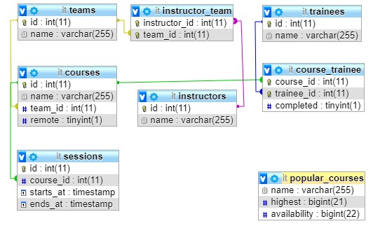

# IT Training
The objective of this assignment is practicing design, development, and implementation of relational databases in a business context.

## Database Structure
The database has the following structure:  


## Stored Procedures
I have created five stored procedures.

### addInstructorToTeam
This procedure is used to associate an instructor with a team. It accepts two parameters: `instructorId` and `teamId`
```sql
DELIMITER $$
CREATE PROCEDURE `addInstructorToTeam` (IN `instructorId` INT, IN `teamId` INT)
BEGIN
	DECLARE val int;
	SELECT COUNT(*) INTO val FROM instructor_team WHERE instructor_id=instructorId;
    IF val < 2 THEN
		INSERT INTO instructor_team VALUES (instructorId, teamId);
    ELSE
    	SELECT "The instructor is already assigned to two teams.";
	END IF;
END$$
DELIMITER ;
```

### addSessionToCourse
This procedure is used to associate a session with a course. It accepts three parameters: `courseId`, `startsAt` and `endsAt`
```sql
DELIMITER $$
CREATE PROCEDURE `addSessionToCourse` (IN `courseId` INT, IN `startsAt` TIMESTAMP, IN `endsAt` TIMESTAMP)
BEGIN
	DECLARE val VARCHAR(255);
	SELECT starts_at INTO val FROM sessions WHERE course_id=courseId ORDER BY starts_at ASC LIMIT 1;
    IF (WEEK(startsAt) - WEEK(val)) < 12 THEN
		INSERT INTO sessions (course_id, starts_at, ends_at) VALUES (courseId, startsAt, endsAt);
    ELSE
    	SELECT "Courses may not extend over more than 12 weeks";
	END IF;
END$$
DELIMITER ;
```

### addTraineeToCourse
This procedure is used to associate a trainee with a course. It accepts two parameters: `courseId` and `traineeId` 
```sql
DELIMITER $$
CREATE PROCEDURE `addTraineeToCourse` (IN `courseId` INT, IN `traineeId` INT)
BEGIN
	DECLARE val int;
	SELECT COUNT(*) INTO val FROM course_trainee WHERE course_id=courseId;
    IF val < 100 THEN
    	IF EXISTS (SELECT course_trainee.trainee_id FROM `course_trainee` INNER JOIN courses ON course_trainee.course_id=courses.id WHERE course_trainee.trainee_id=traineeId AND courses.remote=0) THEN
        	SELECT "This trainee is already enrolled in one onsite course.";
        ELSEIF (SELECT COUNT(*) FROM `course_trainee` INNER JOIN courses ON course_trainee.course_id=courses.id WHERE course_trainee.trainee_id=traineeId AND courses.remote=1) > 2 THEN
			SELECT "This trainee is already enrolled in three online courses.";
        ELSE
            INSERT INTO course_trainee (course_id, trainee_id) VALUES (courseId, traineeId);
        END IF;
    ELSE
        SELECT "Can not add more than 100 trainees per course.";
	END IF;
END$$
DELIMITER ;
```

### whenBusy
This procedure is used to find out when an instructor is occupied. It accepts one parameter: `instructorId`
```sql
DELIMITER $$
CREATE PROCEDURE `whenBusy` (IN `instructorId` INT)
BEGIN
	SELECT instructors.name, starts_at AS occupied FROM instructors INNER JOIN instructor_team ON instructors.id = instructor_team.instructor_id INNER JOIN teams ON teams.id = instructor_team.team_id INNER JOIN courses ON teams.id = courses.team_id INNER JOIN sessions on sessions.course_id=courses.id WHERE instructors.id=instructorId;
END$$
DELIMITER ;
```

### whoCompleted
This procedure is used to find the names of graduates who completed a specific course. It accepts one parameter: `courseId`
```sql
DELIMITER $$
CREATE PROCEDURE `whoCompleted` (IN `courseId` INT)
BEGIN
	SELECT trainees.name FROM trainees INNER JOIN course_trainee ON course_trainee.trainee_id=trainees.id WHERE course_trainee.course_id=courseId AND completed=1;
END$$
DELIMITER ;
```

## Views
I only created a single view, namely `popular_courses`.
This is used to find the most popular courses and the current availability.
```sql
CREATE VIEW `popular_courses`  AS  SELECT `courses`.`name` AS `name`, COUNT(0) AS `highest`,(100 - COUNT(0)) AS `availability` FROM (`courses` JOIN `course_trainee` ON((`courses`.`id` = `course_trainee`.`course_id`))) GROUP BY `course_trainee`.`course_id` ORDER BY `highest` DESC;
```
